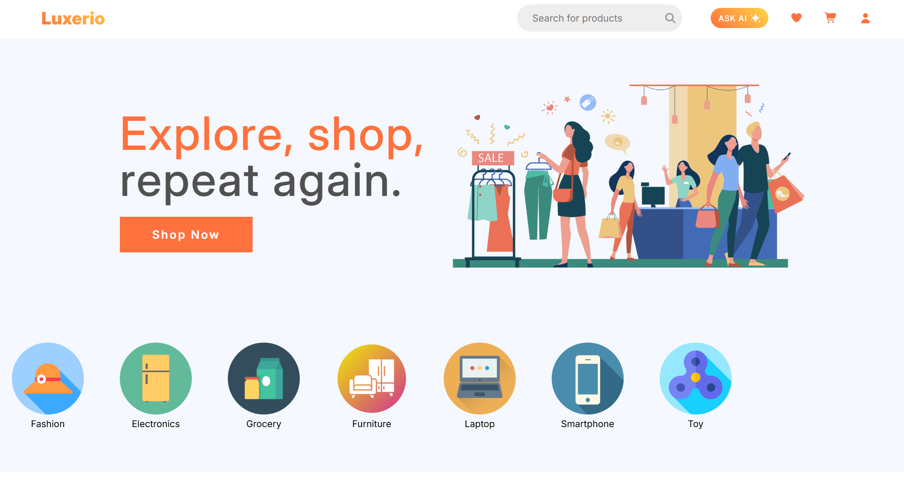
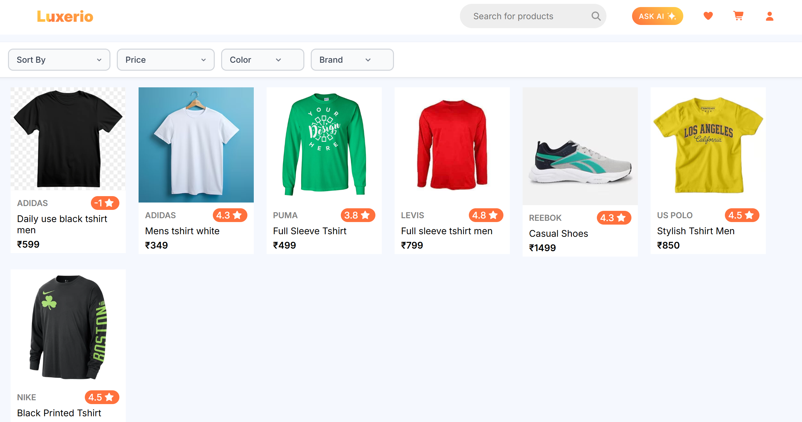
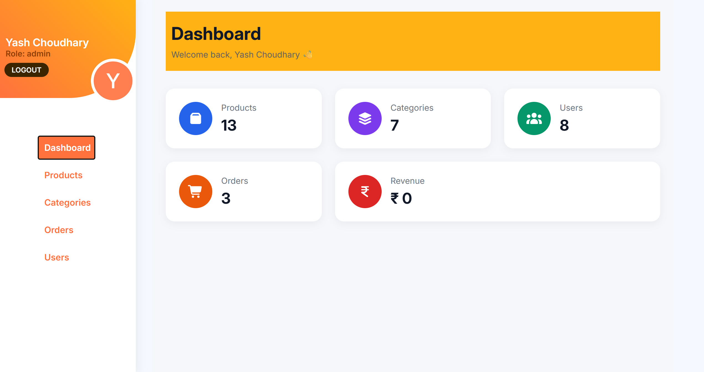

# Luxerio - Full Stack MERN Ecommerce Platform

Luxerio is a full-stack ecommerce application built using the MERN stack. The project includes a complete customer shopping experience along with a dedicated admin panel for managing products, categories, orders, and users.

The goal of this project was to build a realistic ecommerce platform while learning full-stack development, authentication, authorization, API design, state management, and secure backend practices.

---

## Features

### User Features

- User Registration & Login
- JWT Authentication
- Protected Routes
- Product Search
- Product Filtering
- Product Sorting
- Pagination
- Product Details Page
- Add To Cart
- Wishlist Management
- Order Placement
- Profile Page
- Forgot Password
- OTP Based Password Reset
- Change Password

---

### Admin Features

- Admin Dashboard
- Product Management (CRUD)
- Category Management
- Order Management
- User Management
- Product View Page
- Product & Order Overview

---

### Security Features

- JWT Authentication
- Password Hashing using bcrypt
- Zod Validation
- OTP Verification
- Login Rate Limiting
- OTP Request Rate Limiting
- Protected Admin Routes
- Role Based Authorization

---

### AI Features

- AI Chat Integration using Gemini API

---

## Tech Stack

### Frontend

- React.js
- React Router DOM
- Axios
- CSS

### Backend

- Node.js
- Express.js
- MongoDB
- Mongoose

### Authentication & Security

- JWT
- bcrypt
- Zod
- Express Rate Limit

### External Services

- Gemini API
- Nodemailer ( with gmail)
- Cloudinary (for photo upload)

---

## Screenshots

### Home Page



---

### Product Details Page



---

### Admin Dashboard



---

## Project Structure

```bash
Luxerio
│
├── frontend
│   │
│   ├── public
│   │
│   └── src
│       ├── api
│       ├── assets
│       ├── components
│       ├── context
│       ├── layout
│       ├── pages
│       ├── routes
│       └── utility
│
├── backend
│   │
│   ├── uploads
│   │
│   └── src
│       ├── controllers
│       ├── db
│       ├── middleware
│       ├── models
│       ├── routes
│       ├── services
│       ├── validations
│       └── app.js
│
└── README.md
```

## Environment Variables

### Backend (.env)

```env
DB_URL=

JWT_SECRET_KEY=

CLOUD_NAME=

API_KEY=

API_SECRET=

CHAT_SECRET_KEY=

APP_USER=

APP_PASS=

```

---

## Installation

### Clone Repository

```bash
git clone https://github.com/yashu1101/luxerio_ecommerce.git
```

### Frontend

```bash
cd frontend

npm install

npm run dev
```

### Backend

```bash
cd backend

npm install

npm run dev
```

---

## Future Improvements

- Carousel and Banner Add
- Profile Image Upload
- Online Payment Integration
- Product Recommendations
- Advanced Analytics Dashboard
- Multi Address Support

---

## Author

Developed by Yash Choudhary
